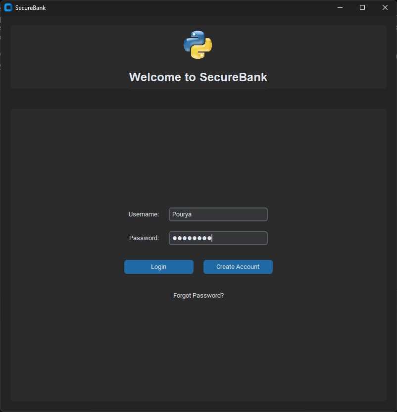
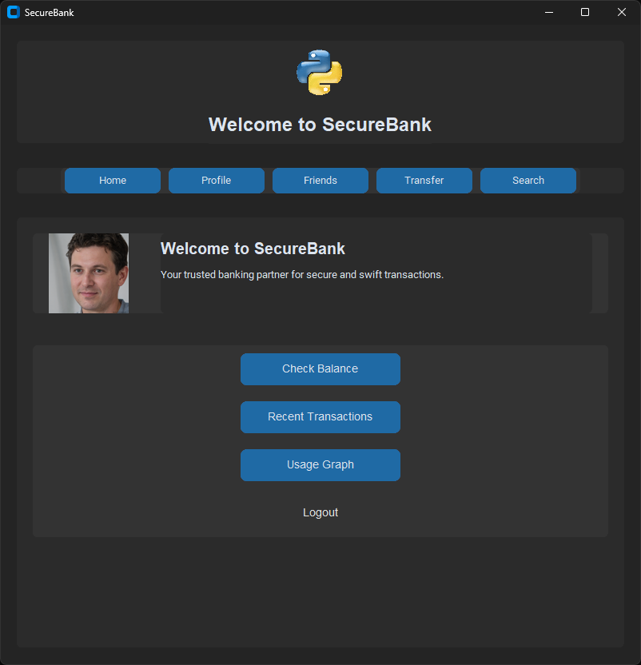
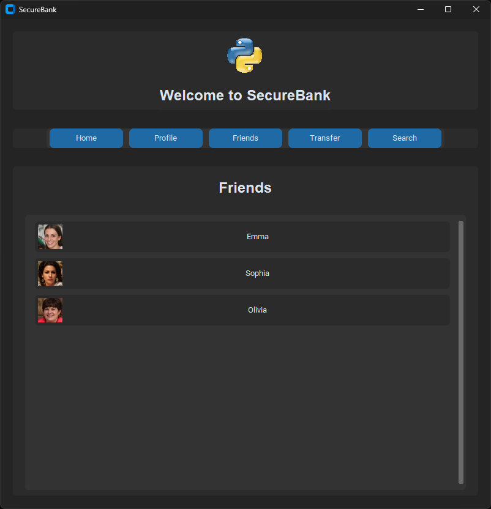
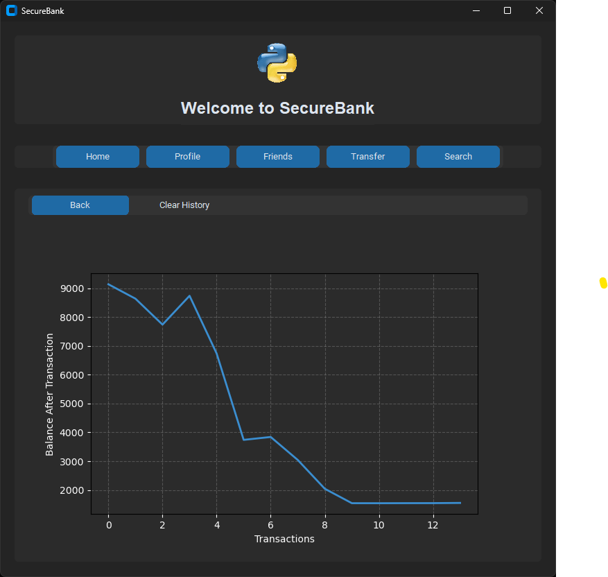
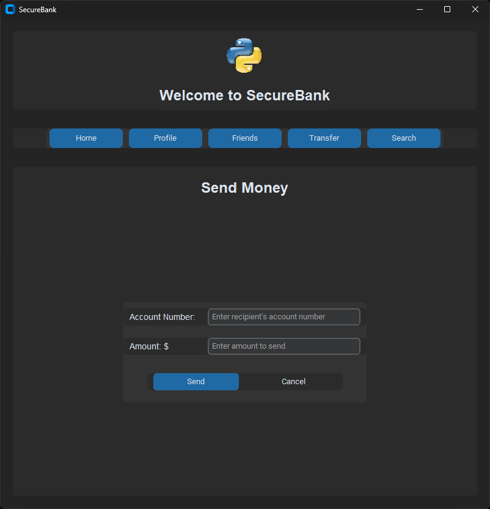

# SecureBank 🏦


A modern, secure, and user-friendly banking transaction management system built with Python and CustomTkinter. Features a sleek dark-themed interface, real-time transaction tracking, and comprehensive account management capabilities.

## 📸 Screenshots

<div align="center">
  
  <p><em>Modern Login Interface with secure authentication and account creation options</em></p>
  
  
  <p><em>User Dashboard - Quick access to balance, transactions, and usage analytics</em></p>
  
  
  <p><em>Friends Management - View and interact with your frequent contacts</em></p>
  
  
  <p><em>Transaction History Visualization - Track your balance changes over time</em></p>
 
  
  <p><em>Secure Money Transfer Interface - Send money to any account with ease</em></p>
</div>

## ✨ Key Features

- 🔒 **Secure Authentication**
  - Password hashing using SHA-256
  - UPI PIN verification for transactions
  - OTP-based password recovery

- 💰 **Transaction Management**
  - Real-time balance tracking
  - Instant money transfers
  - Transaction history visualization
  - Friend payment system

- 👤 **User Profile Management**
  - Profile photo upload and management
  - Personal information management
  - Account settings configuration
  - Customizable user avatars

- 📊 **Analytics & Reporting**
  - Interactive balance history graphs
  - Transaction timeline visualization
  - Recent activity monitoring
  - Custom date range analysis

## 🚀 Installation

1. Clone the repository:
```bash
git clone https://github.com/pouryare/transaction-tracker.git
cd transaction-tracker
```

2. Create a virtual environment (recommended):
```bash
python -m venv venv
source venv/bin/activate  # On Windows: venv\Scripts\activate
```

3. Install required packages:
```bash
pip install -r requirements.txt
```

## 📦 Dependencies

```plaintext
# Core GUI and widgets
customtkinter>=5.2.1
tkcalendar>=1.6.1
CTkMessagebox>=2.5

# Image processing
Pillow>=10.0.0

# Data visualization
matplotlib>=3.7.1

# Database
sqlite3-wrapper>=1.0.1

# Development tools (optional)
black>=23.3.0
flake8>=6.0.0
pytest>=7.3.1
```

## 🎮 Usage

1. Start the application:
```bash
python main.py
```

2. Create a new account or login with existing credentials
3. Use the navigation menu to access different features:
   - Check balance
   - Send money
   - View transaction history
   - Manage profile
   - Search users

## 🏗️ Project Structure

```
transaction-tracker/
├── main.py                 # Application entry point
├── dbfile.py              # Database operations
├── requirements.txt       # Project dependencies
├── myproject.db           # SQLite database
├── python_logo.gif        # Application logo
├── screenshots/           # Application screenshots
│   ├── screenshot-1.png   # Money Transfer Interface
│   ├── screenshot-2.png   # Login Screen
│   ├── screenshot-3.png   # Dashboard
│   ├── screenshot-4.png   # Friends List
│   └── screenshot-5.png   # Transaction Analytics
└── profile_images/        # User profile photos
    ├── Ava.jpg
    ├── Charlotte.jpg
    ├── Emma.jpg
    ├── Evelyn.jpg
    ├── Isabella.jpg
    ├── Mia.jpg
    ├── Olivia.jpg
    ├── Pourya.jpg
    └── Sophia.jpg
```

## 📋 Module Descriptions

### main.py
- Main application window management
- User interface implementation using CustomTkinter
- Event handling and navigation
- Form validation and processing
- Transaction management

### dbfile.py
- SQLite database operations and management
- User authentication and security
- Transaction processing and history
- Profile and friend management
- Balance tracking and updates

## 🔐 Security Features

- Password hashing using SHA-256
- UPI PIN verification for transactions
- OTP-based password recovery system
- Session management
- Input validation and sanitization
- Secure transaction processing

## 💡 Advanced Features

- **Real-time Balance Updates**: Instant reflection of transactions
- **Interactive Graphs**: Visual representation of transaction history
- **Friend Payment System**: Quick transfers to frequent contacts
- **Profile Photo Management**: Personalized user experience
- **Search Functionality**: Find users by name or phone number
- **Dark Theme**: Modern and eye-friendly interface
- **Responsive Design**: Adapts to different window sizes

## 🤝 Contributing

Contributions are welcome! Please feel free to submit a Pull Request. For major changes, please open an issue first to discuss what you would like to change.

1. Fork the repository
2. Create your feature branch (`git checkout -b feature/AmazingFeature`)
3. Commit your changes (`git commit -m 'Add some AmazingFeature'`)
4. Push to the branch (`git push origin feature/AmazingFeature`)
5. Open a Pull Request

## 📝 License

This project is licensed under the MIT License - see the [LICENSE](LICENSE) file for details.

## 👤 Author

**Pouryare**
* GitHub: [@pouryare](https://github.com/pouryare)

## 🌟 Show your support

Give a ⭐️ if this project helped you!

---

> This banking application is designed for educational purposes and demonstrates Python GUI programming with CustomTkinter and secure transaction management.
